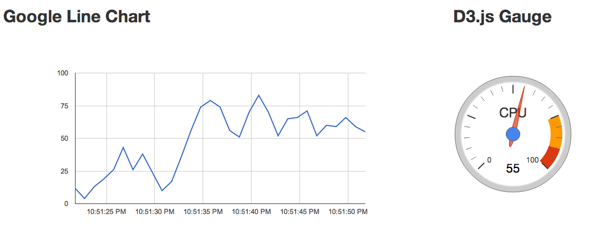

angular-real-time-charts
========================

Real Time Charts with AngularJS.

## AngularJS directives

 Line Chart with Google Charts

 Gauge with D3.js

## Usage

 Install dependencies:

    $ npm install

 Install Bower dependencies:

    $ bower install

 Start Node.js server:

    $ node app

 Application will be available at http://localhost:3000

## Links

 [AngularJS](http://angularjs.org/) JavaScript MVC Framework

 [D3](https://github.com/mbostock/d3) JavaScript Data Visualization library

 [Google Charts](https://developers.google.com/chart/) Charts by Google

 [sockjs-node](https://github.com/sockjs/sockjs-node) Node.js WebSocket server

 [sockjs-client](https://github.com/sockjs/sockjs-client) SockJS client
